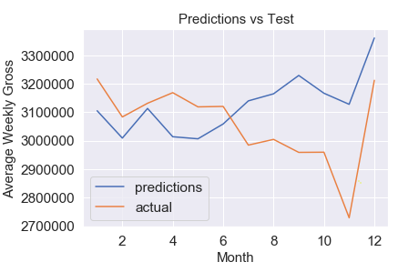
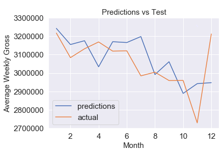

# Predicting the Revenue of Hamilton 

Link to slideshow presentation: https://docs.google.com/presentation/d/1rX0t7Q_ie-mSRFGFblLRrLqIw4imosQBAuIJsxIPCBA/edit#slide=id.p
Link to LinkedIn: https://www.linkedin.com/in/yehuda-schein-19b5bb166/

## Project Overview
The goal of this project was to predict the gross of the hit Broadway show Hamilton. I web scraped the data from the playbill website and gathered the weekly gross of every Broadway show from 1985. I shortened this data set to only include the show Hamilton and changed the gross column (my target variable) to monthly gross. To clarify, this column is not the sum of all the weekly gross in a month, it is the average of all the weekly grosses for each month.

## Date Source
The data was web scraped from https://www.playbill.com/grosses. For more information about the web scraping please see https://github.com/rfordatascience/tidytuesday/tree/master/data/2020/2020-04-28. 

## Purpose / Business Understanding
Predicting the gross of a Broadway show is important for a few reasons. First, if a show is not reaching its full potential then it is very likely that the show will fail. Stakeholders that will be interested in this problem are people that want to invest in Broadway shows and make a profit. The Broadway industry makes billions of dollars every year and each Broadway show costs millions of dollars to produce. And the number one way that a show makes money is by selling tickets. If someone can predict the gross of a Broadway show, then they will be able to know which shows they should invest in. 
Potential stakeholders: The average investment for Broadway shows is only $25,000, about the same amount as most small-businesses. This is a very risky business, but just as it is a high risk, there is also a high reward. However, these investments are only for a time before the show makes it to Broadway. In this project, I analyze the show after it already made it to Broadway. But the same logic applies, just in this case the investment is a more conservative approach. In this case the investment would be higher and the reward would be lower, but there is still a reward. 

## Data Science Process Steps
For this project, I followed the CRISP-DM approach to make sure that my process was clear, organized and eventually produced the best results. I started with the business understanding which is to make sure that an investor is investing in the show at the right time and knows what the future gross will be. I then looked at the data and only included the rows and columns which would contribute to the model. I down-sampled the data to be monthly and then added exogenous variables later to some of the models. I followed an iterative process for the modeling/evaluation process so I can keep track of all the models that I created and know which ones needed change so they can be improved. 

## Data Preparation
The code was very clean and did not contain any missing values, however, I did change a few things. I down-sampled the data set so its monthly instead of weekly. Additionally, after building some baseline and regular models, I added some exogenous variables to see if that influenced the RMSE. More details to the changes that I made to the data are in the notebook.
Below are three graphs that I created. The first one shows week by week what the average gross is. The second one shows the average gross of the weeks of each month (this is the data set that I used). And the third graph shows the total gross of every year.  

I created the graph above so the viewer can see the spikes in December/January time to account for the holiday season. 

The graph above is included so the viewer can see the graph that is used in the data set where I plot average weekly gross per month on the y-axis and time on the x-axis. 

The graph above is included to show that in the years 2017, 2018, and 2019, Hamilton reached its peak and had a higher gross compared to its other years on Broadway. 

## Modeling
The best baseline model was an ARIMA model which gave me an RMSE score of around 160000. This means that the average weekly gross of a month in 2019 was off by an average of $160,000. This is not bad considering that the average weekly price of a month in 2019 is around $3,000,000. I also included ARIMA, ARIMAX, SARIMA, and SARIMAX in the data set. The best model was a SARIMA model with an RMSE of $130,000. Below I show my baseline model and its predictions vs the actual. And underneath that is my best model with the predicted values vs the actual values. 

## Conclusion
In conclusion, we can see that performing a grid search on a SARIMA model (no exogenous variables) gives us the best RMSE of all the other 50 plus models we tried. The order of variables for the Hamilton model is (1,1,0) and the seasonal order is (1,1,0,12). The final Hamilton model gives us an RMSE score of 131273. This means that in the year of 2019, our model was off on each month by its average weekly gross by $131,273. This model performs very well and can tell us whether we should invest in this Broadway show. 

## Future Improvements and Next Steps
When I continue this project, I will try to expand it by predicting on shows before they are even on Broadway. I will try to predict whether the show will make it to Broadway. This will be a classification problem. I can also solve this classification problem by using NLP to analyze articles that are written by Broadway show critics and see if the language that they use in the article will transfer to a successful or unsuccessful show. 

